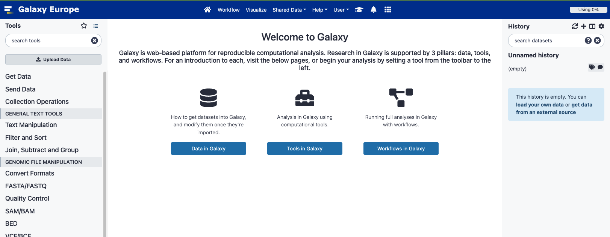

# The Galaxy Platform

Galaxy is an outlier in the set of workflow management systems (WMSs) that we are going
to discuss, because it includes a (web) user interface to design and run the workflows. 
It is **Open Source** under Academic Free License and developed at Penn State, Johns 
Hopkins, OHSU and Cleveland Clinic with substantial contributions from outside these
institutions. The Galaxy Project includes several public serves, including:
- usegalaxy.eu
- usegalaxy.org
- usegalaxy.org.au

And several others. For this exercise, we are going to use usegalaxy.eu. First, let's 
create a user there.

- Create an account in Galaxy

According to the developer, the core values of Galaxy are:
- accessibility (users without programming experience)
- reproducibility
- transparency

## Overview of the Galaxy UI

- On the left, available tools.
- In the center, main panel to run tools and view results.
- On the right, dataset history (where the results will accumulate).

Basic usage: first thing to do is to import a dataset, then search for the right tool (search bar), then execute it and the
results will appear in the central panel. Job results accumulate in your History on the right.  

> ## Tools in Galaxy
>
> The tools you run through Galaxy are the same tools that you can run through the command line.
> {: .source}
{: .callout}

> ## Datasets in Galaxy
>
> Dataset (imported files or result files) in history.
> If you click on a dataset name, you can download it, get a link to it, understand how much resource it is using etc.
> You can also rerun the dataset (learn the exact parameters) and visualise the dataset.
> {: .source}
{: .callout}

Shared Data menu allows you to access dataset for trials and training.

## What happens behind the scenes

When run a workflow, Galaxy takes care of the job submission to HPC. Many jobs can run in parallel.
Galaxy helps you visualizing the job dependencies and status: 
- green: job successfully completed
- yellow: running
- grey: waiting, e.g. for a preliminary task to be completed
- red: failed

It's Galaxy who takes care of figuring out the dependency and running all steps in the correct order.

## Assembling and running the example Workflow in Galaxy

For this demo, we'll use the [public european galaxy server](https://usegalaxy.eu). If you would like to run this demo during or after the workshop, please create a free account. For this, please use the register link in the top menu, also [directly available here](https://usegalaxy.eu/login).

### Step-by-Step 

#### Login in usegalaxy.eu
- Create a new History (if needed) and name it "ORF Detection"

#### Grab a cDNA FASTA link from ENSEMBL FTP web site
- Open a new tab in your browser
- Go to the [ensembl web site](https://www.ensembl.org/index.html), select human and click on the `Download FASTA` link available in the `Gene annotation` panel. This brings you to the FTP site
- Navigate to the `cdna` folder and **right-click** on the `Homo_sapiens.GRCh38.cdna.all.fa.gz` file to copy its URL (`copy link address`)
- Go back to your galaxy tab and click the `Upload Data` at the top of the `Tools` panel (on the left).
- In the pop-up, click the `Paste/Fetch data` on the bottom and :
  - Paste the copied FTP URL to the main text area: `http://ftp.ensembl.org/pub/release-105/fasta/homo_sapiens/cdna/Homo_sapiens.GRCh38.cdna.all.fa.gz`
  - Give a name to the file: `Homo_sapiens.GRCh38.cdna.all.fa.gz`
  - Set the type to : `fasta.gz`
  - Set the Genome to: start typing `grch38` and select `Human Dec. 2013 ...(hg38)`
  - Click `Start` and then `Close`

=> a new dataset is created in your history. The grey color indicates that the job creating this dataset is not yet started. The dataset color will turn "salmon (?)" when the job will be executing to finally become green (or red) upon successful completion (or error)

#### Split the downloaded FASTA

For this we will use the `faSplit` tool

- Search for `faSplit` (mind the case) in the Tools' search box
- Click on the `faSplit Split a FASTA file` tool
- Fill in the form:
  - **Input**: the fastq file we just fetched
  - **Split by**: `Number of files (for multi sequence FASTA)`
  - **Number of chunks**:10
- Click `Execute`

=> The result dataset is now a `collection` of FASTA files (for a weird reason 9 files were created)

#### Predict ORFs with the `getorf` tool
- Search for `getorf ` or `ORF` in the Tools' search box
- Fill in the form:
  - **Input**: click on the `folder` icon to select your fasta file collection
  - Use defaults for all other fields
- Click `Execute`

=> The files are processed in parallel i.e. they are executed on different cluster node at the same time (if cluster load permits)

#### Filter FASTA on the requested motif

- Search for `Filter FASTA on the headers and` in the Tools' search box
  - the tool should be in the first 10 hits (yes the galaxy search is not the best)
- Fill in the form:
  - **Input**: click on the `folder` icon to select your getorf collection
  - **Criteria for filtering on the sequences**: select `Regular expression...`
    - Add `VERA` in the new **Regular expression pattern the sequence should match** test box
- Click `Execute`

####  Merge back translated fastq files

- Search for `Concatenate datasets tail-to-head` in the Tools' search box
  - the tool should be in the first 10 hits (yes the galaxy search is not the best)
- Fill in the form:
  - **Input**: click on the `folder` icon to select your `Filter FASTA` collection
- Click `Execute`

### Optional Extract unique list of transcript (ENST)

####  Step 1: convert the fasta file to a tabular format

- Search for ` FASTA-to-Tabular converter` in the Tools' search box
- Fill in the form:
  - **Input**: select the merged dataset from previous step
  - **How many columns to divide title string into?**: `2`
- Click `Execute`

=> the result is a table with 3 columns:

- The ENST ID in col 1
- The rest of the description in col 2
- The sequence in col 3

####  Step 2: reformat the accession number

- Search for `Column Regex Find And Replace` in the Tools' search box
- Fill in the form:
  - **Input**: select the table generated at previous step
  - Click on **insert Check**
    - **Find Regex**: paste `(ENST[0-9]+)\..+`
    - **Replacement**: `\1`
- Click `Execute`

####  Step 3: extract the first column

- Search for `Cut columns from a table` in the Tools' search box
- Fill in the form:
  - **Input**: select the table generated at previous step
  - **Cut columns**: paste `c1`
- Click `Execute`

####  Step 4: extract the unique list of ENST

- Search for `Unique occurrences of each record (Galaxy Version 1.1.0)` in the Tools' search box
- Fill in the form:
  - **Input**: select the table generated at previous step
- Click `Execute`

### Workflow creation/extraction

Use the `Extract Workflow` in the history options and adapt the name (to eg 'VERA ORF Predition WF') and click `Create Workflow` and immediatly click the `edit` link on the notification.

When extracting the workflow, only select the steps described above ie make sure to unselect any other computation you may have done.

Once in the workflow editor, review each step and make sure the option are identical to those above ; and all connections are preserved.

Then click run and select the fasta cDNA FASTA file and click `Run`



